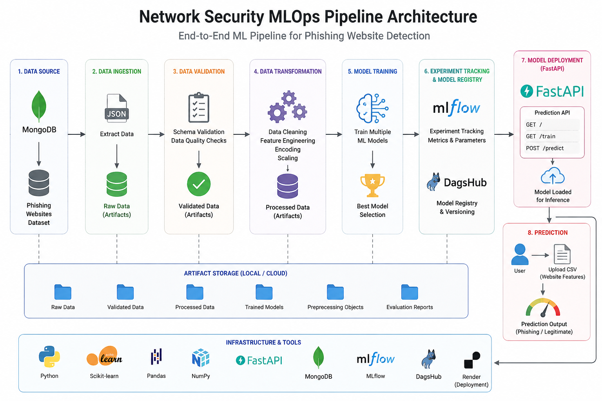
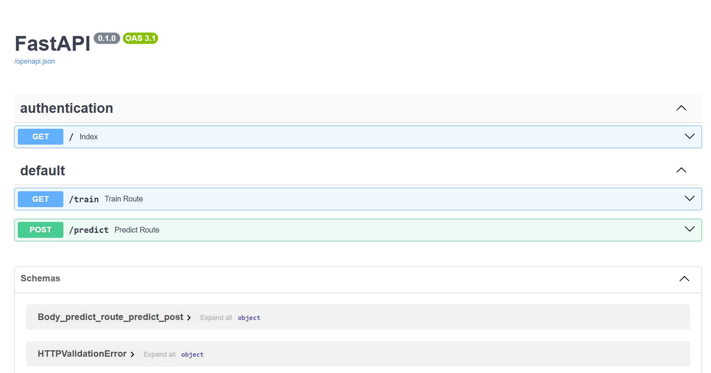

# 🛡️ Network Security MLOps Pipeline


## 🚀 Overview

This project presents a production-ready end-to-end MLOps pipeline for phishing website detection. It automates the complete machine learning lifecycle, from data ingestion and preprocessing to model training, evaluation, experiment tracking, and deployment.

Built using FastAPI, Scikit-Learn, MongoDB, MLflow, and DagsHub, the system provides a scalable API that allows users to upload website feature datasets and obtain phishing detection predictions. The project follows industry-standard MLOps practices to ensure reproducibility, maintainability, and efficient model management.

The primary objective of this project is to demonstrate how machine learning models can be developed, tracked, deployed, and served through a robust end-to-end pipeline in a real-world cybersecurity use case.

---

## 🎯 Key Highlights

- Built and deployed an end-to-end MLOps pipeline for phishing website detection.
- Automated data ingestion, validation, transformation, model training, and prediction workflows.
- Integrated MLflow and DagsHub for experiment tracking and model management.
- Developed REST APIs using FastAPI for model training and batch prediction.
- Deployed the application on Render with publicly accessible Swagger documentation.

---

## 🌐 Live Demo

### API Documentation

https://network-security-mlops-1.onrender.com/docs

### GitHub Repository

https://github.com/sarvesh2099/network-security-mlops

---

## 🏗️ System Architecture



---

## 🔄 MLOps Workflow

```text
MongoDB Atlas
      │
      ▼
Data Ingestion
      │
      ▼
Data Validation
      │
      ▼
Data Transformation
      │
      ▼
Model Training
      │
      ▼
MLflow + DagsHub Tracking
      │
      ▼
Model Selection
      │
      ▼
FastAPI Deployment
      │
      ▼
Render Cloud Hosting
      │
      ▼
Prediction API
```

---

## ✨ Features

- End-to-End MLOps Pipeline
- Automated Data Ingestion from MongoDB
- Data Validation & Quality Checks
- Feature Engineering & Data Transformation
- Machine Learning Model Training
- Model Evaluation & Selection
- Experiment Tracking using MLflow
- DagsHub Integration
- FastAPI REST API
- Batch Prediction via CSV Upload
- Cloud Deployment on Render
- Artifact Management
- Scalable Prediction Pipeline

---

## 🛠️ Tech Stack

### Programming Language

- Python

### Machine Learning

- Scikit-Learn
- Pandas
- NumPy

### Backend

- FastAPI
- Uvicorn

### Database

- MongoDB Atlas

### MLOps

- MLflow
- DagsHub

### Deployment

- Render

### Version Control

- Git
- GitHub

---

## 📡 API Endpoints

### Home

```http
GET /
```

Redirects to Swagger Documentation.

### Train Model

```http
GET /train
```

Triggers the complete model training pipeline.

### Predict

```http
POST /predict
```

Upload a CSV file and receive phishing detection predictions.

---

## 📸 Project Screenshots

### Swagger API Documentation




## 📂 Project Structure

```text
NetworkSecurity/
│
├── networksecurity/
│   ├── components/
│   ├── pipeline/
│   ├── entity/
│   ├── exception/
│   ├── logging/
│   ├── utils/
│   └── cloud/
│
├── templates/
├── notebooks/
├── Artifacts/
├── final_model/
│
├── app.py
├── main.py
├── requirements.txt
├── setup.py
└── README.md
```

---

## ⚙️ Installation

### Clone Repository

```bash
git clone https://github.com/sarvesh2099/network-security-mlops.git
```

### Navigate to Project

```bash
cd network-security-mlops
```

### Create Virtual Environment

```bash
conda create -p venv python=3.10 -y
```

### Activate Environment

```bash
conda activate ./venv
```

### Install Dependencies

```bash
pip install -r requirements.txt
```

### Run Application

```bash
python app.py
```

---

## 🎯 Future Improvements

- Docker Containerization
- CI/CD using GitHub Actions
- Real-Time URL Prediction Interface
- Interactive Frontend Dashboard
- Model Monitoring & Drift Detection
- AWS Deployment

---

## 👨‍💻 Author

**Sarvesh Ambavkar**

Machine Learning & Full-Stack Development Enthusiast

Interested in Machine Learning, MLOps, Backend Development, Cloud Computing, and Scalable Software Systems.

